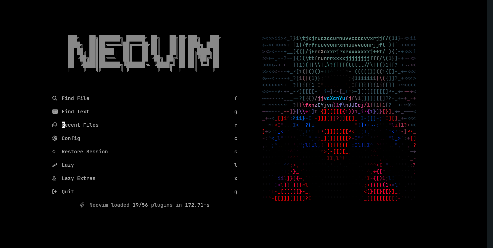

# nvim-config/

<a href="https://dotfyle.com/harsha007009/nvim-config"></a>
<a href="https://dotfyle.com/harsha007009/nvim-config"></a>
<a href="https://dotfyle.com/harsha007009/nvim-config"></a>



## Install Instructions

> Install requires Neovim 0.9+. Always review the code before installing a configuration.

Clone the repository and install the plugins:

```sh
git clone git@github.com:harsha007009/nvim-config ~/.config/harsha007009/nvim-config
```

Open Neovim with this config:

```sh
NVIM_APPNAME=harsha007009/nvim-config/ nvim
```

## Plugins

### color

- [NvChad/nvim-colorizer.lua](https://dotfyle.com/plugins/NvChad/nvim-colorizer.lua)

### colorscheme

- [sainnhe/gruvbox-material](https://dotfyle.com/plugins/sainnhe/gruvbox-material)
- [RRethy/base16-nvim](https://dotfyle.com/plugins/RRethy/base16-nvim)

### colorscheme-creation

- [rktjmp/lush.nvim](https://dotfyle.com/plugins/rktjmp/lush.nvim)

### comment

- [folke/todo-comments.nvim](https://dotfyle.com/plugins/folke/todo-comments.nvim)

### competitive-programming

- [kawre/leetcode.nvim](https://dotfyle.com/plugins/kawre/leetcode.nvim)

### completion

- [hrsh7th/nvim-cmp](https://dotfyle.com/plugins/hrsh7th/nvim-cmp)

### editing-support

- [gbprod/yanky.nvim](https://dotfyle.com/plugins/gbprod/yanky.nvim)
- [folke/snacks.nvim](https://dotfyle.com/plugins/folke/snacks.nvim)

### file-explorer

- [nvim-neo-tree/neo-tree.nvim](https://dotfyle.com/plugins/nvim-neo-tree/neo-tree.nvim)

### formatting

- [stevearc/conform.nvim](https://dotfyle.com/plugins/stevearc/conform.nvim)

### fuzzy-finder

- [nvim-telescope/telescope.nvim](https://dotfyle.com/plugins/nvim-telescope/telescope.nvim)

### icon

- [nvim-tree/nvim-web-devicons](https://dotfyle.com/plugins/nvim-tree/nvim-web-devicons)

### lsp

- [neovim/nvim-lspconfig](https://dotfyle.com/plugins/neovim/nvim-lspconfig)
- [mfussenegger/nvim-lint](https://dotfyle.com/plugins/mfussenegger/nvim-lint)
- [rmagatti/goto-preview](https://dotfyle.com/plugins/rmagatti/goto-preview)
- [smjonas/inc-rename.nvim](https://dotfyle.com/plugins/smjonas/inc-rename.nvim)

### motion

- [folke/flash.nvim](https://dotfyle.com/plugins/folke/flash.nvim)

### nvim-dev

- [nvim-lua/plenary.nvim](https://dotfyle.com/plugins/nvim-lua/plenary.nvim)
- [MunifTanjim/nui.nvim](https://dotfyle.com/plugins/MunifTanjim/nui.nvim)
- [folke/lazydev.nvim](https://dotfyle.com/plugins/folke/lazydev.nvim)

### plugin-manager

- [folke/lazy.nvim](https://dotfyle.com/plugins/folke/lazy.nvim)

### preconfigured

- [LazyVim/LazyVim](https://dotfyle.com/plugins/LazyVim/LazyVim)

### project

- [nvim-telescope/telescope-project.nvim](https://dotfyle.com/plugins/nvim-telescope/telescope-project.nvim)

### snippet

- [L3MON4D3/LuaSnip](https://dotfyle.com/plugins/L3MON4D3/LuaSnip)
- [rafamadriz/friendly-snippets](https://dotfyle.com/plugins/rafamadriz/friendly-snippets)

### syntax

- [nvim-treesitter/nvim-treesitter](https://dotfyle.com/plugins/nvim-treesitter/nvim-treesitter)

### tabline

- [akinsho/bufferline.nvim](https://dotfyle.com/plugins/akinsho/bufferline.nvim)

### utility

- [atiladefreitas/dooing](https://dotfyle.com/plugins/atiladefreitas/dooing)

### web-development

- [roobert/tailwindcss-colorizer-cmp.nvim](https://dotfyle.com/plugins/roobert/tailwindcss-colorizer-cmp.nvim)

## Language Servers

- astro
- clangd
- html
- svelte

This readme was generated by [Dotfyle](https://dotfyle.com)
